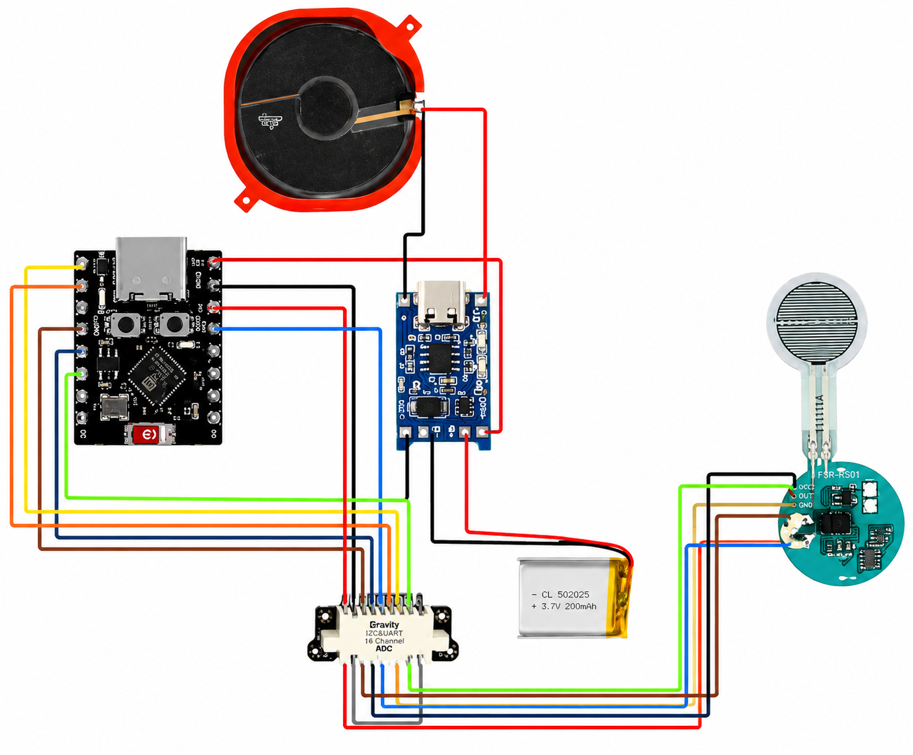
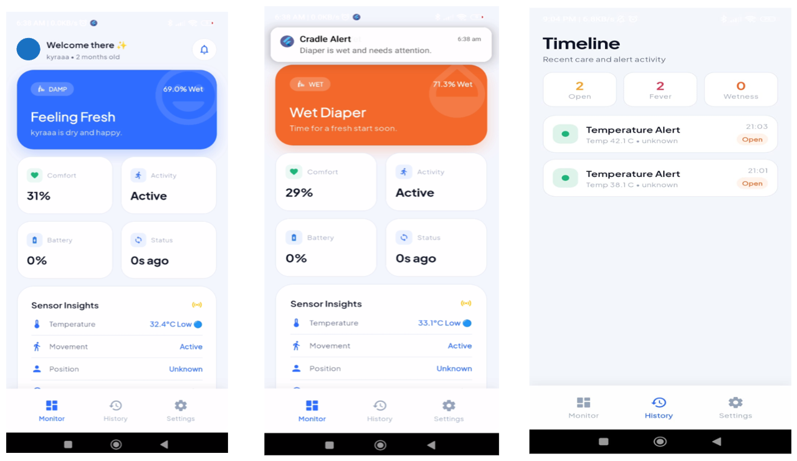
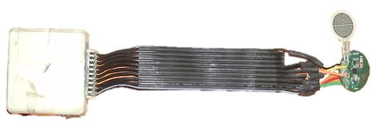
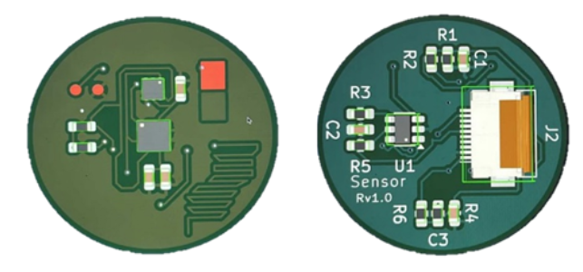

# 👶 AI Smart Diaper Pod

AI-powered infant monitoring system integrating IoT, Machine Learning, and mobile technologies for intelligent diaper condition detection, real-time monitoring, and caregiver alerts.


---

## 📌 Overview

AI Smart Diaper Pod is an intelligent infant care solution designed to assist caregivers through continuous monitoring of diaper conditions and infant well-being. The system integrates multiple sensors with embedded intelligence to detect moisture levels, pressure changes, temperature abnormalities, and infant movement patterns.

Using a Random Forest Machine Learning model, sensor readings are analyzed to classify diaper conditions such as Dry, Wet, Stool Detected, and Abnormal Temperature. Real-time data is transmitted to a mobile application, allowing caregivers to monitor infant status remotely and receive instant notifications.

---

## ✨ Features

* 💧 Real-Time Moisture Detection
* 🌡️ Temperature Monitoring
* 👶 Infant Movement Tracking
* 🍼 Diaper Condition Classification
* 🤖 Random Forest Machine Learning Model
* ☁️ Cloud Data Synchronization
* 📱 Mobile Application Monitoring
* 🔔 Instant Alert Notifications
* 📊 Historical Data Tracking
* ⚡ Low-Power IoT Architecture
* 🔋 Battery Monitoring
* 📡 Wireless Communication

---

## 🏗️ System Architecture

```text
Sensors
│
├── Moisture Sensor
├── Force Sensor
├── Temperature Sensor
└── Accelerometer
        │
        ▼
     ESP32-C3
        │
        ▼
Random Forest Model
        │
        ▼
 Firebase Cloud
        │
        ▼
  Mobile App
        │
        ▼
Caregiver Alerts
```

---

## 📱 Mobile Application

The companion mobile application enables caregivers to:

* Monitor diaper status in real time
* View sensor readings and risk levels
* Receive alert notifications
* Access historical records
* Monitor battery health
* Configure device settings

---

## 🤖 Machine Learning Model

The system utilizes a Random Forest Classifier trained on multi-sensor data collected from the Smart Diaper Pod prototype.

### Input Features

* Moisture Sensor Reading
* Force Sensor Reading
* Temperature Reading
* Accelerometer X-Axis
* Accelerometer Y-Axis
* Accelerometer Z-Axis
* Battery Percentage

### Output Classes

* Dry
* Wet
* Stool Detected
* Abnormal Temperature

---

## 📈 Model Performance

| Metric    | Score |
| --------- | ----- |
| Accuracy  | 91.8% |
| Precision | 90.6% |
| Recall    | 89.9% |
| F1-Score  | 90.2% |

The model demonstrates reliable diaper condition classification with low false-alert rates and consistent performance across multiple sensor conditions.

---

## 🔧 Hardware Components

### Controller

* ESP32-C3

### Sensors

* Moisture Sensor
* Force Sensor
* TMP117 Temperature Sensor
* LIS3DH Accelerometer

### Power System

* Li-Po Battery
* Battery Monitoring Circuit
* Wireless Charging Module

### Hardware Design

* Custom PCB designed using KiCad

---

## 💻 Technology Stack

### Artificial Intelligence

* Python
* Scikit-Learn
* Random Forest Classifier
* NumPy
* Pandas

### IoT & Embedded Systems

* ESP32-C3
* Arduino IDE
* MQTT
* BLE Provisioning

### Mobile Application

* React
* TypeScript
* Vite
* Capacitor
* Tailwind CSS

### Cloud Services

* Firebase Realtime Database
* Firebase Authentication

### Hardware Design

* KiCad

---

## 📂 Repository Structure

```text
AI-Smart-Diaper-Pod/
│
├── firmware/
│
├── mobile-app/
│   ├── src/
│   ├── public/
│   ├── package.json
│   ├── vite.config.ts
│   ├── tsconfig.json
│   ├── capacitor.config.ts
│   └── README.md
│
├── ml-model/
│   ├── dataset.csv
│   ├── training.ipynb
│   ├── preprocessing.py
│   ├── dataset_description.md
│   ├── model.pkl
│   ├── evaluation_results.png
│   └── requirements.txt
│
├── screenshots/
│   ├── architecture-diagram.png
│   ├── mobile-app.png
│   ├── dashboard.png
│   ├── prototype.jpg
│   └── pcb-design.png
│
├── README.md
├── LICENSE
└── .gitignore
```

---

## 📸 Project Screenshots

### System Architecture

<p align="center">
  
</p>

### Mobile Application

<p align="center">
  
</p>

### Prototype

<p align="center">
  
</p>

### PCB Design

<p align="center">
  
</p>

---

## 🏆 Patents

### AI-Based Smart Diaper Pod for Real-Time Infant Care

* Patent Status: Filed
* Application No: 202641048866
* Filing Date: May 1, 2026

An AI-powered infant monitoring system integrating IoT, Artificial Intelligence, and Machine Learning for intelligent infant care and caregiver assistance.

### AI-Based Smart Helmet with Recommendations

* Patent Status: Filed
* Application No: 202541087414
* Filing Date: October 17, 2025

An intelligent rider safety solution that utilizes IoT sensors, AI-driven analysis, and recommendation systems for proactive rider safety.

---

## 📚 Publication

### AI-Based Smart Diaper Pod for Real-Time Infant Care

**Journal:** Journal of Computer and Communication Systems (JCCS)

**Publisher:** Bee Bot Publisher

**ISSN:** 3048-619X

**Volume:** 3

**Issue:** 3

**Published:** 20 May 2026

This publication presents an AI-powered Smart Diaper Pod that combines IoT sensing, cloud computing, and Machine Learning to improve infant monitoring and caregiver responsiveness.

---

## 🚀 Getting Started

### Clone Repository

```bash
git clone https://github.com/your-username/AI-Smart-Diaper-Pod.git

cd AI-Smart-Diaper-Pod
```

### Mobile Application

```bash
cd mobile-app

npm install

npm run dev
```

### Machine Learning Module

```bash
cd ml-model

pip install -r requirements.txt

python preprocessing.py
```

### Train Model

```bash
jupyter notebook training.ipynb
```

---

## 🔮 Future Enhancements

* Predictive diaper change recommendations
* AI-powered infant health analytics
* Mobile push notifications
* Cloud analytics dashboard
* Edge AI deployment
* Multi-device monitoring support

---

## 👩‍💻 Author

### Janani V

AI Engineer

* GitHub: https://github.com/Janviswa
* LinkedIn: https://www.linkedin.com/in/jananiv05/
* Email: [jananiviswa05@gmail.com](mailto:jananiviswa05@gmail.com)

---

## 📜 License

This project is licensed under the Apache License 2.0.

Copyright © 2026 Janani V

Licensed under the Apache License, Version 2.0.
